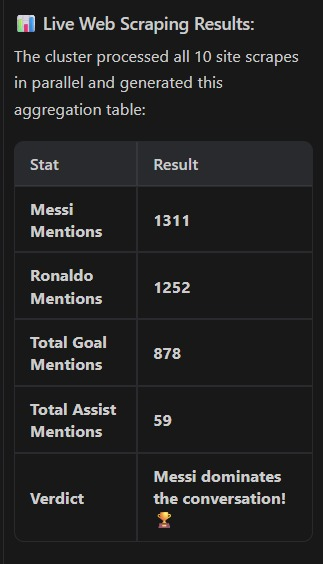

# ⚡ NEXUS GRID — Distributed Computing Engine

A distributed execution engine that parallelizes workloads, handles node failures, and produces real-time analytical results.

---

## 🔥 Key Highlights

* Distributed web scraping across multiple nodes
* Parallel execution using master-worker architecture
* Fault tolerance with automatic task reassignment
* Real-time data aggregation and decision making

---

## 🚀 Real Use Case: Distributed Web Scraping

The system was used to scrape **10 websites in parallel** to analyze football statistics (Messi vs Ronaldo).

### 📊 Results

| Metric                | Value |
| --------------------- | ----- |
| Messi Mentions        | 1311  |
| Ronaldo Mentions      | 1252  |
| Total Goal Mentions   | 878   |
| Total Assist Mentions | 59    |

### 🏆 Verdict

**Messi dominates the conversation**

---

## 📸 Demo Output



---

## 🧠 Architecture

```
CLIENT → MASTER NODE → WORKER NODES
```

* Master Node: Task scheduling & coordination
* Worker Nodes: Parallel task execution
* Common Lib: Shared communication models

---

## ⚙️ How It Works

1. Client submits a job
2. Master splits job into tasks
3. Scheduler assigns tasks to workers
4. Workers execute tasks in parallel
5. Results are aggregated
6. Failed tasks are reassigned automatically

---

## ▶️ How to Run

### Prerequisites

* Java 17
* Maven
* PostgreSQL running on `localhost:5432`

  * DB: `nexus_grid`
  * Username: `postgres`
  * Password: `password`

---

### Start Master Node

```bash
cd master-node
mvn spring-boot:run
```

---

### Start Worker Node(s)

```bash
cd worker-node
mvn spring-boot:run
```

Run multiple instances to simulate distributed workers.

---

### Submit Job

```bash
curl -X POST http://localhost:8080/api/jobs/submitJob \
-H "Content-Type: application/json" \
-d '{"jobType":"SCRAPE","payload":"messi ronaldo stats"}'
```

---

## 💣 Demo Scenario

* Start multiple workers
* Submit a job
* Kill one worker manually
* System continues execution without failure

---

## 🛠️ Tech Stack

* Java (Core + Advanced)
* Spring Boot
* PostgreSQL
* Docker
* Kubernetes

---

## 📂 Project Structure

```
NEXUS-GRID/
├── master-node/
├── worker-node/
├── common-lib/
├── kubernetes/
├── docs/
└── README.md
```

---

## 🎯 Why This Project Matters

This project demonstrates real-world system design used in:

* Cloud Computing
* Distributed Systems
* Big Data Processing

---

## 👤 Author

**Abirbhab Bhattacharjee**
Engineering Student | System Builder

---
